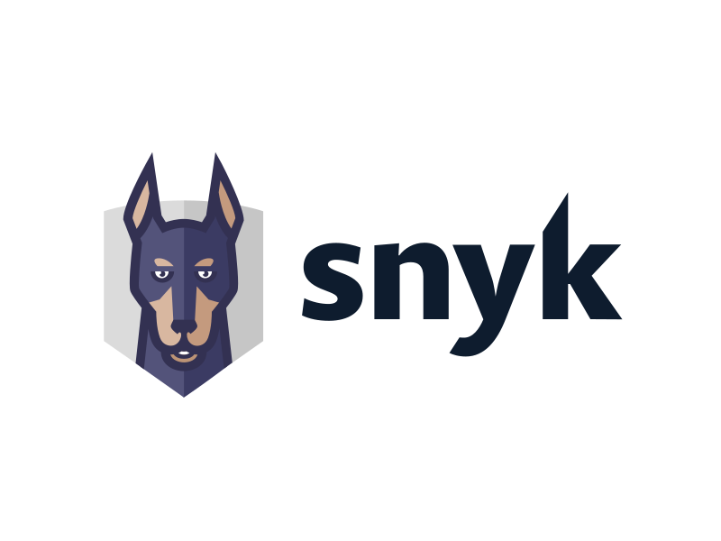

# Interview Task: Building a Hybrid Query System (No Frameworks)

_See the original assignment PDF under `docs` folder._

## Objective

We'd like you to design and implement a system that can answer user questions by intelligently querying both a structured database (SQL) and an unstructured text corpus (via vector search). The key challenge is to do this without relying on existing LLM frameworks like Langchain, LlamaIndex, etc. You will need to implement the core logic for query understanding, decomposition, data retrieval, and answer synthesis.

## System Requirements

1. Input: The system should accept a natural language question from the user.
2. Outputs: This final step should synthesize the information and generate a coherent, natural language answer to the user's original question.

## Implementation Notes

- No Frameworks: You must not use libraries like Langchain, Haystack, LlamaIndex, or any other comprehensive RAG/LLM agent frameworks. Standard libraries for database interaction (e.g. `sqlite3`), numerical operations (e.g., `numpy` for vector math if needed), and basic text processing are acceptable.
- Frontend: A command-line interface (CLI) for interaction is perfectly acceptable.
- Focus: The emphasis is on your understanding of the components of such a system, the logic flow, and how you would approach building it from more fundamental pieces.

## Demonstration & Discussion

During our meeting, we'd like you to:

1. Demonstrate your system with a few example questions.
2. Talk us through your implementation: Explain your design choices, the logic for query decomposition, data retrieval, result combination, and answer synthesis.
3. Discuss the challenges you encountered while building this system from scratch, particularly in the absence of high-level frameworks.

## Q & A

After reading the task description I collected and sent to Snyk these questions, and they were addressed.

| Question                                                                                                                                                                                                                                     | Answer                                                                                     |
| -------------------------------------------------------------------------------------------------------------------------------------------------------------------------------------------------------------------------------------------- | ------------------------------------------------------------------------------------------ |
| I can freely select data domain, correct? For example, company data (SQL for users/orders) and a text corpus with policies, or structured vulnerability data with unstructured "hacker news" content.                                        | Yes the data can be freely selected. Both examples are fine.                               |
| Can I use an LLM API for the query decomposition? If not, what is the expectation? I plan a keyword/rule-based router to classify queries as 'SQL', 'Vector', or 'Hybrid'.                                                                   | Using an LLM API for query decomposition is fine.                                          |
| For 'query understanding' I will use a rule-based router that detects specific patterns (e.g., "who bought", "what is"). Is it more important to show the component exists and supports a few examples than to build a comprehensive parser? | Up to the candidate to decide what yields a good outcome for a reasonable time investment. |
| Is English-only acceptable?                                                                                                                                                                                                                  | Yes — English-only is fine.                                                                |
| I am not planning to build a full natural-language-to-SQL generator; my demo will match specific patterns. Is that acceptable?                                                                                                               | These choices are part of the task, therefore, we cannot comment on this one               |
| Do you expect a TF‑IDF implementation for embeddings or use of a 3rd-party vector store (e.g., MongoDB Atlas)?                                                                                                                               | These choices are part of the task & up to you                                             |
| I plan to use JavaScript/Node.js. Is that OK?                                                                                                                                                                                                | It's up to you to decide this stack :)                                                     |
